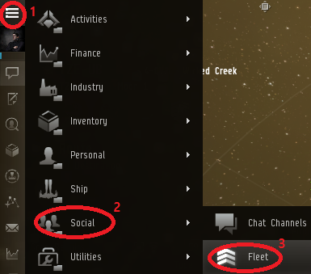
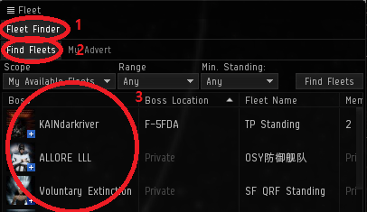

# 1. 플릿 참가 및 준비

## 플릿 참가

1. **Discord PING 채널에 공지 확인**

   * 기본적으로 이브시간\(ET\)를 기준으로 공지 됨
   * ET에 9시간을 더하면 한국시간이 됨
   * 예시\) ET 13:00 = KT 22:00

2. **Discord &gt; VOICE &gt; KR Voice 접속**

   \*\*\*\*

3. **TeamSspeak 3 접속**

   \*\*\*\*

4. **Fleet 들어가기** \(동영상 설명: [https://youtu.be/HSY6rKs7KRw](https://youtu.be/HSY6rKs7KRw)\)

   * Fleet 창 열기 

      

     * 드래그 앤 드롭을 통해 Neocom Shortcut에 올릴 수 있음

   * Fleet 창 &gt; Fleet Finder &gt; Find Fleets 탭에서 플릿 찾아서 더블 클릭

     * 대부분의 경우 Boss = Errestrian인 플릿 찾으면 됨

      

5. **널섹 옵의 경우 캡슐 비우기**

   * 옵 = 오퍼레이션/작전
   * 캡슐 비우기 = 임플란트 없는 캡슐로 바꾸기

6. **Discord PING 채널에 어떤 함선을 타야 되지 공지되어 있면 해당 함선 타고 대기**

   * 캡슐로 있으면 FC가 플릿 구성을 확인 할 수 없기 때문에 배를 타고 있을 것

## 체크리스트

* 임플란트
* 피팅 \(리핏 모듈 포함\)
* 보험
* 소모품 \(탄환/드론/스크립트/나나이트/마약\)
* 와치리스트 \(퍼스트/세컨드 앵커\)
* 네비게이션 세팅 Prefer Shorter
* 브로드캐스트 세팅
* 시큐리티 레드

