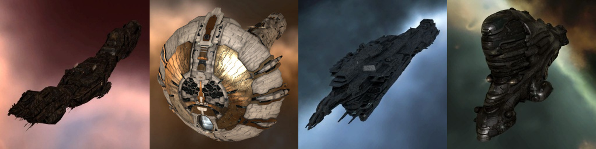

# 4. 이동

## 타이탄 브릿지 타는 법

* 타이탄

  * 엄청 크고 비싼 배

  

* 타이탄 브릿지를 이용하면 게이트를 이용하지 않고 다른 성계로 점프 가능 \(항상 사용하는 것은 아님\)
* Afterburner/Microwarpdrive **“끄고”**
* 타이탄에 Keep Range 1000m 하여 대기
* 타이탄 브릿지가 열리면 타이탄 우클릭 후 Jump Through to XXX 클릭


**\(중요!!\)** Keep Range가 아닌 Approach를 하거나 프롭 모듈를 켜지 말것



**\(중요!!\)** 타이탄으로 Warp to 0km 하지 말것




## 플릿 이동

* 얼라인/워프/점프 **"FC의 오더"**에 따라 이동
  * 얼라인 바로 바로 하기
  * 임의로 워프/점프하지 말것





