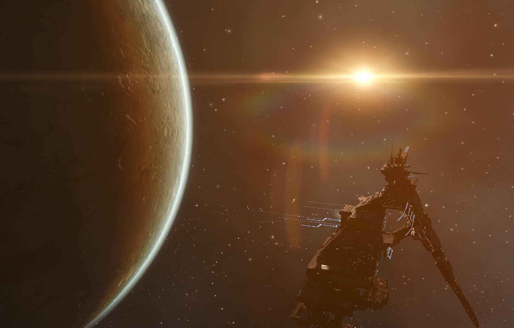

# 1. 소개

2013년도, Black rise 지역에서 PVP를 즐기던 몇몇 한국인들이 Nisuwa에 거점을 잡고 하나둘씩 모이기 시작하였음. 처음엔 프리깃만 타고다녔지만, 경험이 쌓이면서 점점 큰배를 타게되고, 이브온라인 갤러리에서 공개적으로 사람들을 모으며 플릿을 꾸리기 시작함. 그러다가 Errestrian이 한국인 유저들을 끌어모아 당시 지역의 패권자 Snuff box라는 꼽과 트리아지/가디언을 대동한 플릿전을 하기 시작하였음.

하지만 당시의 Snuff box는 스킬 포인트도 높고, 플릿전 경험도 많은 엘리트꼽이었으며 한국인 플릿은 경험도 거의없었고, 비싼배도 타기 어려운 실정이었음. 하지만 여러 동맹들의 지원에 힘입어 이기기도, 지기도하면서 이브온라인 갤러리에서 공개적으로 계속 플릿을 진행하였음. 하지만 Snuff box가 여러 지역의 꼽들을 통합하면서 Snuffed out 얼라이언스로 재탄생하였고, 점차 Black rise를 장악해나가기 시작함. 이 상태로는 이들과의 전쟁에서 이길수없다고 판단한 Errestrian은 제대로된 플릿전을 하기위하여 Sons of black rise를 만들었음. 

![Sons of Black Rise \[SOBR.\]](../.gitbook/assets/image%20%2845%29.png)

걸음마를 뗀 Sons of black rise에게 필요한것은 안정적인 자금 수금원이었음. 당시 패권자가 바뀌며 혼란스러웠던 Genesis지역을 침공, 자금원이될 문마이닝 포스들을 대다수 장악하는데 성공했으나 길어지는 전쟁의 피로도를 견디지 못하고 결국 패배하고 말았음.

이에 목표인 Snuffed out을 이기기 위해서는 첫 걸음마부터 다시 시작해야한다고 판단하여 Amarr/Minmatar 팩션워페어 지역으로 SOBR은 이동하였고, 거기서 제일 아래등급의 함선인 프리깃부터 다시 시작한다는 마음가짐으로 수많은 뉴비들을 리크루팅하였음.

한편, 새로 이동한 Amarr/Minmatar 팩션워페어 지역은 Dead terrorist라는 패권자가 Did he say jump라는 도전자를 상대로 맞서 싸우는 상태였음. Dead terrorist는 당시 발발한 WWB의 로섹 볼트론 멤버였고, WWB를위해 상당수의 전력을 북부 널섹에 투사해야만하는 상황이었음.

이런 혼란스런 상황에서 SOBR은 Amarr 팩션워페어 얼라이언스인 Local is Primary에 가입하여 Dead terrorist와의 전쟁에서 양면 전선에 무너져가던 Dead terrorist를 무너뜨리는데 결정적인 역할을 하였음

하지만 Did he say jump는 자신들이 이 지역의 패권자가 되길 원했고, Local is Primary와의 동맹을 깨고 전쟁을 선포, 곧바로 Did he say jump와의 전쟁을 시작하게됨. 상당수의 전투를 이기며 문마이닝 포스도 잘 수비해나갔지만, 몇개월이나 지속된 전쟁을 견디지 못하고 엑티브는 감소하기 시작했고, 결국 피로도가 극에 달할때쯤, SOBR은 Local is Primary를 탈퇴하고 널섹으로 가기로 결정함.

SOBR은 유명 얼라이언스인 Black legion의 후신, White legion에 가입하여 다시 한번 전성기를 맞이하였으나, White legion 얼라이언스 리더쉽들의 지속적인 부재, 컨텐츠 고갈로 White legion을 떠나기로 결정하였음.

White legion을 떠난 SOBR이 선택한곳은 로섹의 명문가 Shadow cartel이었음. SOBR에게 러브콜을 보내는곳은 많았으나, 당시 Snuffed out의 라이벌로 인식되던 Shadow cartel을 선택한것은 필연적인 결정이었음.

하지만 Shadow cartel은 현상을 유지하길 원했고, SOBR의 엑티브는 줄어들기 시작함. 이에 SOBR은 Shadow cartel을 떠나 다시 한번 Amarr/Minmatar 팩션워페어 지역으로 이동하여 지역의 패권자가된 Did he say jump와 대결하기로 결정, Shadow cartel을 떠남.

호기롭게 Shadow cartel을 떠난 SOBR이었지만 현실은 가혹했음. Did he say jump는 Shadow cartel에게 전폭적인 지지를 얻고 있었고, 이제 막 Did he say jump와 교전을 시작하는 SOBR을 사사건건 방해했음. 이런 상황에서, 고립되어가던 전선의 분위기를 바꾸고, 직접 로섹의 운명을 결정짓기위해 SOBR은 Siege green 얼라이언스를 창설하였음.

![Siege Green. \[SGGRN\]](../.gitbook/assets/image%20%2844%29.png)

하지만 Shadow cartel의 방해에도 불구하고, SGGRN은 Did he say jump를 상대로 승승장구하였음. 이에 크게 자극받은 Shadow cartel은 Did he say jump를 돕고, 남부 로섹에 있는 자신들의 어셋을 지키기위해 직접 Amarr/Minmatar 팩션워페어 지역으로 파병을오게됨.

Shadow cartel의 파병에도 불구하고, SGGRN은 여러 로섹의 집단들을 끌어모아 연합군을 만들었고, Shadow cartel/Did he say jump 연합을 상대로 기적적으로 승리를 거두게됨.

하지만 Shadow cartel은 덩치부터가 비교불가능한 집단이었고, 몇번의 승리이후 찾아온것은 지독한 체급차이로인한 패배였음. 이에 굴하지않고 SGGRN은 계속해서 적의 피로도를 극대화 시키며 전쟁을 이어나갔고, 긴 전쟁의 피로도를 견디지 못하고 Did he say jump는 역사의 뒤안길로 사라졌음. 파트너를 잃고, 약해져만가던 전력을 견디지 못한 Shadow cartel은 SGGRN의 남부 지배를 인정하고 전략적 파트너쉽을 맺게됨.

이후 Did he say jump의 잔당들의 봉기를 진압하며 SGGRN은 명실공히 Amarr/Minmatar 팩션워페어 지역의 패권자로 군림하며, Black rise를 수복할 그날을 기다리며 힘을 기르는 중.

